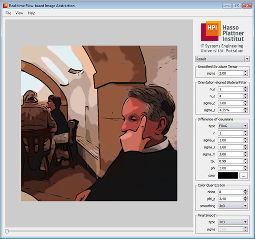

# flowabs

Real-time Flow-based Image and Video Abstraction

This program implements an automatic image and video abstraction technique based on the orientation-aligned bilateral and separable flow-based difference of Gaussians filters. It was written by [Jan Eric Kyprianidis](http://www.kyprianidis.com/) while working as a research scientist for the [computer graphics systems group](http://www.hpi3d.de/) of the [Hasso-Plattner-Institut](http://www.hpi.uni-potsdam.de/) at the University of Potsdam, Germany.

A detailed discussion of the implementation can be found in the ShaderX7 book (Kyprianidis & Döllner, 2009). For more details on technical aspects see (Kyprianidis & Döllner, 2008).

## Building
Building requires the [Qt cross platform toolkit](http://qt.nokia.com/). Recommended Qt version is 4.7.2. The program has been tested to successfully build with Visual Studio 2008 on Windows, Qt Creator SDK 2.1.0 on Mac OS X and the default toolchain on Ubuntu 10.10. See build.bat/build.sh to get started. Video processing is only available on Mac OS X and Windows and requires Apple QuickTime. The Apple [QuickTime](http://www.apple.com/quicktime) SDK for Windows can be downloaded here.

## Related Publications
* Kyprianidis, J. E. & Döllner, J. (2009). Real-Time Image Abstraction by Directed Filtering. In W. Engel (Ed.), ShaderX7 - Advanced Rendering Techniques. Charles River Media.
* Kyprianidis, J. E. & Döllner, J. (2008). Image Abstraction by Structure Adaptive Filtering. In Proc. EG UK Theory and Practice of Computer Graphics, pp. 51–58.